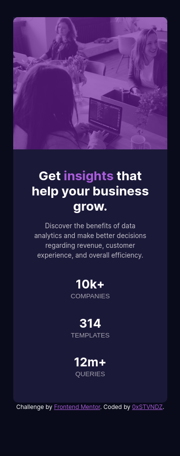

# Frontend Mentor - Stats preview card component solution

This is a solution to the [Stats preview card component challenge on Frontend Mentor](https://www.frontendmentor.io/challenges/stats-preview-card-component-8JqbgoU62). Frontend Mentor challenges help you improve your coding skills by building realistic projects. 

## Table of contents

- [Overview](#overview)
  - [The challenge](#the-challenge)
  - [Screenshot](#screenshot)
  - [Links](#links)
- [My process](#my-process)
  - [Built with](#built-with)
  - [What I learned](#what-i-learned)
- [Author](#author)
- [Acknowledgments](#acknowledgments)

## Overview

### The challenge

Users should be able to:

- View the optimal layout depending on their device's screen size

### Screenshot

### Links

- [Solution](https://github.com/0xSTVNDZ/stats-preview-card-component-main)
- [Live](https://0xstvndz.github.io/stats-preview-card-component-main/)

## My process

### Built with

- Semantic HTML5 markup
- CSS custom properties
- Flexbox
- CSS Grid
- Mobile-first workflow
- CSS Bootstrap

### What I learned

I didnt get to actually complete the challenge, yet. Not sure how I'm supposed to flip the picture and text section without having to change the HTML? 

## Author

- Github - [0xSTVNDZ](https://github.com/0xSTVNDZ)
- Frontend Mentor - [@0xSTVNDZ](https://www.frontendmentor.io/profile/0xSTVNDZ)
- Twitter - [@0xSTVNDZ](https://www.twitter.com/0xSTVNDZ)

## Acknowledgments

Shoutout to Frontendmentor for the challenge. My dearest gratitude.